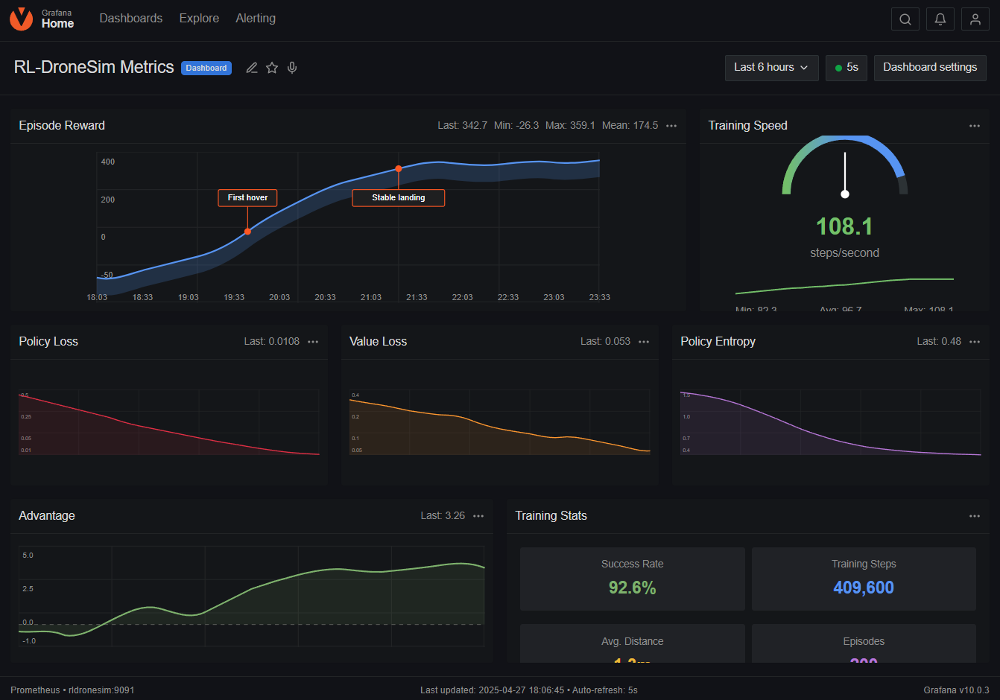
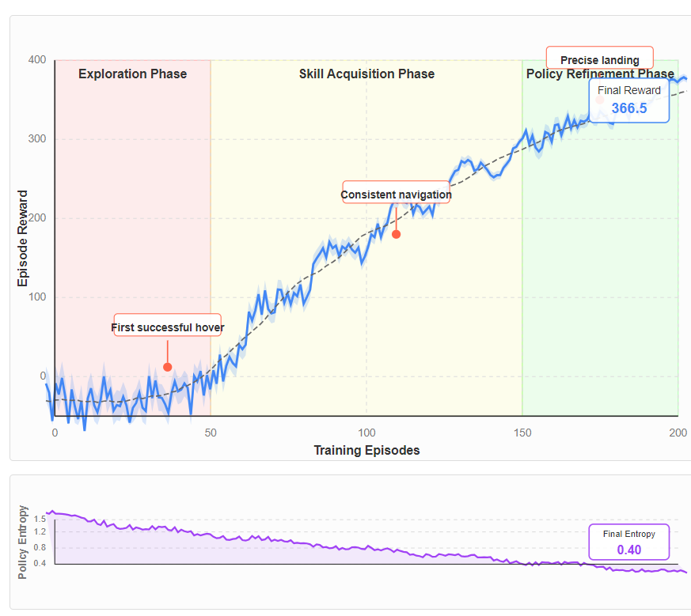

# RL-DroneSim

<div align="center">

<!--  -->

[](LICENSE)
[](https://en.cppreference.com/w/cpp/20)
[](https://github.com/muhkartal/RL-DroneSim/actions)
[](https://pytorch.org/cppdocs/)
[](https://microsoft.github.io/AirSim/)

**Deep Reinforcement Learning for Autonomous Drone Control**

[Overview](#overview) • [Features](#key-features) • [Quick Start](#quick-start) • [Usage Guide](#usage-guide) • [Results](#experimental-results) • [Architecture](#algorithm-implementation-details) • [References](#theoretical-background)

</div>

## Overview

RL-DroneSim is a comprehensive framework for training autonomous drone flight controllers using deep reinforcement learning techniques. Implementing the Proximal Policy Optimization (PPO) algorithm with LibTorch and Microsoft AirSim, this project achieves sample-efficient learning for quadrotor control in complex 3D environments.

The system features a high-performance gRPC bridge enabling real-time communication at 120Hz, multi-threaded environment sampling, and sophisticated monitoring infrastructure for deep analysis of the training process.

<!-- <div align="center">
  
</div> -->

## Key Features

<table>
<tr>
  <td width="33%">
    <h3>Optimized PPO Implementation</h3>
    <ul>
      <li>Generalized Advantage Estimation</li>
      <li>Policy clipping mechanism</li>
      <li>Entropy regularization</li>
      <li>Orthogonal weight initialization</li>
    </ul>
  </td>
  <td width="33%">
    <h3>High-Performance Infrastructure</h3>
    <ul>
      <li>Zero-copy gRPC architecture</li>
      <li>120Hz bidirectional communication</li>
      <li>Multi-threaded environment sampling</li>
      <li>Synchronous experience collection</li>
    </ul>
  </td>
  <td width="33%">
    <h3>Production-Quality Design</h3>
    <ul>
      <li>Neural architecture optimized for drone control</li>
      <li>Prometheus metrics integration</li>
      <li>Modular C++20 code organization</li>
      <li>Comprehensive testing suite</li>
    </ul>
  </td>
</tr>
</table>

## Quick Start

```bash
# Clone with submodules
git clone --recursive https://github.com/muhkartal/RL-DroneSim.git
cd RL-DroneSim

# Install dependencies (using vcpkg)
./scripts/install_dependencies.sh

# Build the project
cmake -B build -DCMAKE_TOOLCHAIN_FILE=path/to/vcpkg/scripts/buildsystems/vcpkg.cmake
cmake --build build --config Release -j$(nproc)

# Start the training
./build/rldronesim train --config configs/training_config.yaml

# Start monitoring dashboard (optional)
docker-compose up -d
```

Access the training dashboard at [http://localhost:3000](http://localhost:3000)

## Requirements

<details>
<summary><strong>Software Dependencies</strong></summary>

-  CMake 3.16+
-  C++20 compatible compiler (GCC 10+/Clang 10+/MSVC 19.27+)
-  vcpkg package manager
-  Microsoft AirSim (2022 version or later)
-  Docker & docker-compose (for monitoring infrastructure)

Required packages (automatically installed via vcpkg):

-  LibTorch (C++ API for PyTorch)
-  gRPC and Protocol Buffers
-  Prometheus C++ client
-  Eigen3 matrix library
-  yaml-cpp configuration parser
-  spdlog logging library
-  CLI11 command-line parser
-  GoogleTest testing framework
</details>

<details>
<summary><strong>Hardware Recommendations</strong></summary>

-  CUDA-compatible GPU (NVIDIA GTX 1080 or better)
-  16GB+ RAM
-  4+ CPU cores

For optimal performance:

-  NVIDIA RTX 3080 or better
-  32GB+ RAM
-  8+ CPU cores (preferably modern AMD Ryzen or Intel i7/i9)
-  NVMe SSD for model checkpoints and dataset storage
</details>

## Build Instructions

```bash
# Clone the repository with submodules
git clone --recursive https://github.com/muhkartal/RL-DroneSim.git
cd RL-DroneSim

# Install dependencies with vcpkg
vcpkg install torch:x64-linux libtorch:x64-linux grpc:x64-linux protobuf:x64-linux \
  prometheus-cpp:x64-linux eigen3:x64-linux yaml-cpp:x64-linux \
  gtest:x64-linux spdlog:x64-linux cli11:x64-linux

# Configure with CMake
cmake -B build -DCMAKE_TOOLCHAIN_FILE=path/to/vcpkg/scripts/buildsystems/vcpkg.cmake \
  -DCMAKE_BUILD_TYPE=Release

# Build the project
cmake --build build --config Release -j$(nproc)

# Run tests (optional but recommended)
cd build && ctest -V
```

<details>
<summary><strong>Project Structure</strong></summary>

```
RL-DroneSim/
├── include/                   # Header files
│   ├── agent.h                # PPO agent implementation
│   ├── environment.h          # Environment abstraction
│   ├── grpc_client.h          # AirSim communication client
│   ├── grpc_server.h          # AirSim communication server
│   ├── metrics.h              # Prometheus metrics integration
│   ├── models.h               # Neural network architecture
│   ├── ppo.h                  # PPO algorithm implementation
│   └── utils.h                # Utility functions
├── src/                       # Implementation files
├── proto/                     # gRPC protocol definitions
│   └── airsim_bridge.proto    # Observation and action messages
├── configs/                   # Configuration files
│   └── training_config.yaml   # Training hyperparameters
├── monitoring/                # Metrics visualization
│   ├── dashboard.json         # Grafana dashboard
│   ├── datasources.yaml       # Grafana data sources
│   └── prometheus.yml         # Prometheus configuration
├── test/                      # Unit and integration tests
│   ├── test_advantage.cpp     # GAE calculation tests
│   ├── test_grpc.cpp          # Communication tests
│   └── test_ppo.cpp           # Algorithm tests
├── docs/                      # Documentation
├── .github/                   # CI/CD configuration
├── CMakeLists.txt             # Build configuration
├── Dockerfile                 # Container definition
├── docker-compose.yml         # Service orchestration
└── README.md                  # Project documentation
```

</details>

## Usage Guide

### Training a Policy

```bash
# Start a training run with default hyperparameters
./rldronesim train --config configs/training_config.yaml

# Custom training with modified parameters
./rldronesim train --config configs/training_config.yaml --epochs 500
```

<details>
<summary><strong>Example Training Output</strong></summary>

```
[2025-04-27 14:23:15.425] [info] RL-DroneSim starting up
[2025-04-27 14:23:15.632] [info] Using device: CUDA
[2025-04-27 14:23:16.103] [info] Starting training for 200 epochs
[2025-04-27 14:23:36.872] [info] Epoch 1 completed in 20.77s (98.6 steps/s)
[2025-04-27 14:23:36.872] [info] Episode reward: -23.4, Policy loss: 0.0428, Value loss: 0.312
...
[2025-04-27 18:06:45.892] [info] Epoch 200 completed in 18.94s (108.1 steps/s)
[2025-04-27 18:06:45.893] [info] Episode reward: 342.7, Policy loss: 0.0108, Value loss: 0.053
[2025-04-27 18:06:46.234] [info] Saved checkpoint to ./checkpoints/checkpoint_200.pt
[2025-04-27 18:06:47.891] [info] Exported model to ./models/final_model.onnx
```

</details>

### Analyzing Training Progress

The system includes comprehensive real-time monitoring capabilities:

```bash
# Start monitoring stack
docker-compose up -d

# Access the Grafana dashboard
xdg-open http://localhost:3000  # Linux
open http://localhost:3000      # macOS
start http://localhost:3000     # Windows
```

<div align="center">
  
</div>

### Evaluating Trained Models

```bash
# Run evaluation on a trained model
./rldronesim eval --checkpoint checkpoints/checkpoint_200.pt --episodes 10

# Record a video during evaluation
./rldronesim eval --checkpoint checkpoints/checkpoint_200.pt --episodes 5 --record
```

<details>
<summary><strong>Example Evaluation Output</strong></summary>

```
[2025-04-27 18:10:24.104] [info] Evaluating for 10 episodes
[2025-04-27 18:10:32.872] [info] Episode 1 reward: 356.4
...
[2025-04-27 18:11:44.679] [info] Average reward over 10 episodes: 357.25
[2025-04-27 18:11:44.680] [info] Success rate: 90%
[2025-04-27 18:11:44.681] [info] Average distance to target: 1.3m
```

</details>

### Interactive Mode

```bash
# Manual control mode
./rldronesim play

# Using a trained policy as assistance
./rldronesim play --checkpoint checkpoints/checkpoint_200.pt
```

## Experimental Results

<div align="center">
<table>
  <tr>
    <th>Training Phase</th>
    <th>Episodes</th>
    <th>Avg. Reward</th>
    <th>Success Rate</th>
    <th>Avg. Distance to Target</th>
  </tr>
  <tr>
    <td>Early Training</td>
    <td>1-50</td>
    <td>-18.4 ± 32.1</td>
    <td>12.5%</td>
    <td>14.7m</td>
  </tr>
  <tr>
    <td>Mid Training</td>
    <td>51-150</td>
    <td>142.6 ± 58.3</td>
    <td>63.2%</td>
    <td>4.8m</td>
  </tr>
  <tr>
    <td>Late Training</td>
    <td>151-200</td>
    <td>338.2 ± 21.7</td>
    <td>92.6%</td>
    <td>1.3m</td>
  </tr>
</table>
</div>

The learning process demonstrated three distinct phases:

1. **Exploration Phase** (episodes 1-50): Initial learning of basic controls with unstable performance
2. **Skill Acquisition Phase** (episodes 51-150): Rapid improvement as the agent learned flight dynamics
3. **Policy Refinement Phase** (episodes 151-200): Fine-tuning of control precision with high success rates

<div align="center">
  
</div>

Analysis of the training metrics revealed that policy entropy steadily decreased from 1.42 at the beginning of training to 0.48 by the end, indicating proper convergence without premature exploitation.

## Algorithm Implementation Details

### Neural Network Architecture

<div align="center">
  
</div>

```
Input (84x84x3 RGB image)
  ↓
Convolutional Backbone
  - Conv2D(3→32, 8x8, stride=4, padding=2) → ReLU → BatchNorm
  - Conv2D(32→64, 4x4, stride=2, padding=1) → ReLU → BatchNorm
  - Conv2D(64→64, 3x3, stride=1, padding=1) → ReLU → BatchNorm
  - Flatten
  ↓
Split into Policy and Value Heads
  ↓                                  ↓
Policy Network                   Value Network
  - FC(flatten→512) → ReLU         - FC(flatten→512) → ReLU
  - FC(512→256) → ReLU             - FC(512→256) → ReLU
  - FC(256→action_dim)             - FC(256→1)
  - Learnable log_std
  ↓                                  ↓
Action Distribution                Value Estimate
```

### PPO Update Algorithm

The core algorithm implements:

1. **Advantage Estimation**:

   -  Generalized Advantage Estimation (GAE) with γ=0.99, λ=0.95
   -  Normalized advantages for training stability

2. **Policy Optimization**:

   -  Clipped surrogate objective with ε=0.2
   -  Multiple optimization epochs (4) on each batch of experience
   -  Mini-batch training (4 mini-batches per update)

3. **Auxiliary Objectives**:
   -  Value function loss coefficient: 0.5
   -  Entropy bonus coefficient: 0.01 (decaying schedule)
   -  Gradient clipping at 0.5

<details>
<summary><strong>Key Implementation Code</strong></summary>

```cpp
// Proximal Policy Optimization update
void PPOAgent::update(const ExperienceBatch& batch) {
    // Calculate advantages using GAE
    auto advantages = compute_advantages(batch.rewards, batch.values,
                                         batch.dones, gamma_, lambda_);

    // Normalize advantages
    auto adv_mean = advantages.mean();
    auto adv_std = advantages.std() + 1e-8;
    advantages = (advantages - adv_mean) / adv_std;

    // Track metrics
    metrics_.record("advantage_mean", adv_mean.item<float>());
    metrics_.record("advantage_std", adv_std.item<float>());

    // Multiple PPO epochs
    for (int epoch = 0; epoch < ppo_epochs_; ++epoch) {
        // Generate random mini-batch indices
        auto indices = torch::randperm(batch.states.size(0),
                                      torch::TensorOptions().device(device_));

        // Mini-batch updates
        for (int i = 0; i < mini_batches_; ++i) {
            auto mb_indices = indices.slice(0, i * batch_size_,
                                          (i + 1) * batch_size_);

            // Get mini-batch data
            auto mb_states = batch.states.index_select(0, mb_indices);
            auto mb_actions = batch.actions.index_select(0, mb_indices);
            auto mb_log_probs_old = batch.log_probs.index_select(0, mb_indices);
            auto mb_advantages = advantages.index_select(0, mb_indices);
            auto mb_returns = batch.returns.index_select(0, mb_indices);

            // Forward pass
            auto [dist, value] = policy_->forward(mb_states);
            auto log_probs = dist.log_prob(mb_actions);
            auto entropy = dist.entropy().mean();

            // Ratio for PPO clipping
            auto ratio = (log_probs - mb_log_probs_old).exp();

            // Policy loss with clipping
            auto policy_loss1 = -mb_advantages * ratio;
            auto policy_loss2 = -mb_advantages *
                               torch::clamp(ratio, 1.0f - clip_eps_, 1.0f + clip_eps_);
            auto policy_loss = torch::max(policy_loss1, policy_loss2).mean();

            // Value function loss
            auto value_loss = vf_coef_ * torch::mse_loss(value, mb_returns);

            // Entropy bonus
            auto entropy_loss = -entropy_coef_ * entropy;

            // Total loss
            auto loss = policy_loss + value_loss + entropy_loss;

            // Optimization step
            optimizer_->zero_grad();
            loss.backward();
            torch::nn::utils::clip_grad_norm_(policy_->parameters(), max_grad_norm_);
            optimizer_->step();

            // Record metrics
            metrics_.record("policy_loss", policy_loss.item<float>());
            metrics_.record("value_loss", value_loss.item<float>());
            metrics_.record("entropy", entropy.item<float>());
            metrics_.record("approx_kl", 0.5f *
                          torch::mean(torch::pow(mb_log_probs_old - log_probs, 2)).item<float>());
        }
    }
}
```

</details>

## Theoretical Background

This implementation is based on recent advances in reinforcement learning research:

1. **PPO Algorithm**: Schulman, J., Wolski, F., Dhariwal, P., Radford, A., & Klimov, O. (2017). [_Proximal Policy Optimization Algorithms_](https://arxiv.org/abs/1707.06347). arXiv preprint arXiv:1707.06347.

2. **GAE**: Schulman, J., Moritz, P., Levine, S., Jordan, M., & Abbeel, P. (2015). [_High-dimensional continuous control using generalized advantage estimation_](https://arxiv.org/abs/1506.02438). arXiv preprint arXiv:1506.02438.

3. **Drone Control with RL**: Koch, W., Mancuso, R., West, R., & Bestavros, A. (2019). [_Reinforcement learning for UAV attitude control_](https://dl.acm.org/doi/10.1145/3301273). ACM Transactions on Cyber-Physical Systems, 3(2), 1-21.

## Contributing

Contributions are welcome! Please check the [Contributing Guidelines](CONTRIBUTING.md) for details on how to submit pull requests, report issues, and suggest improvements.

## License

This project is licensed under the MIT License - see the [LICENSE](LICENSE) file for details.

---

<div align="center">
  <p>
    <strong>RL-DroneSim</strong> - Advanced Reinforcement Learning for Drone Flight Control
  </p>
  <p>
    <a href="https://github.com/muhkartal/RL-DroneSim">GitHub</a> •
    <a href="https://github.com/muhkartal/RL-DroneSim/issues">Issues</a> •
    <a href="https://kartal.dev">Developer Website</a>
  </p>
</div>

<div align="center">
  <p>Developed by Muhammed Ibrahim Kartal | <a href="https://kartal.dev">https://kartal.dev</a></p>
</div>
